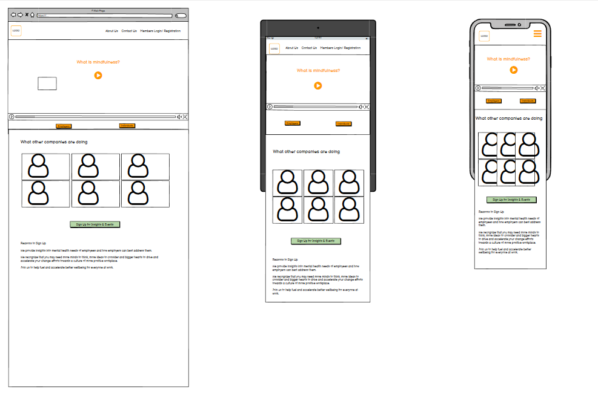
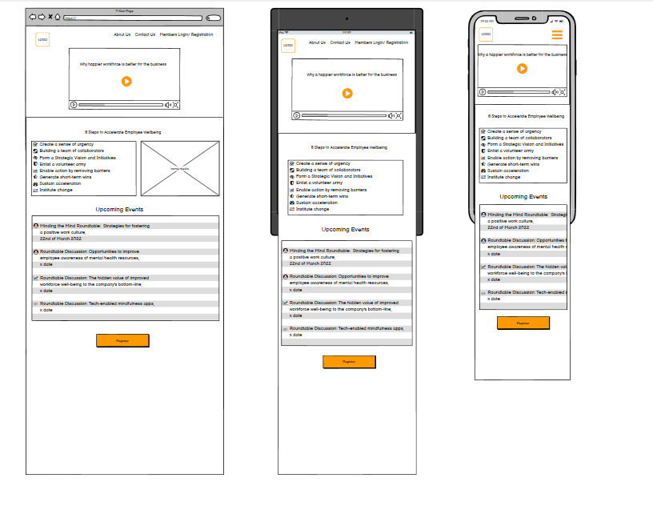
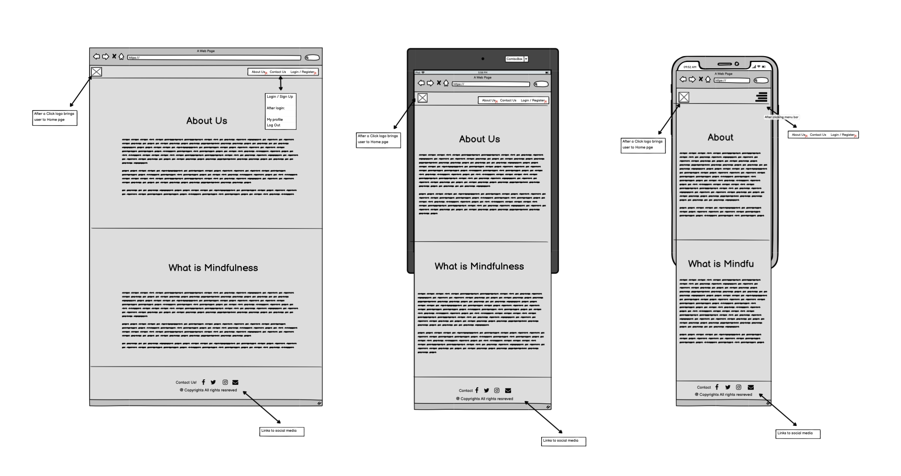
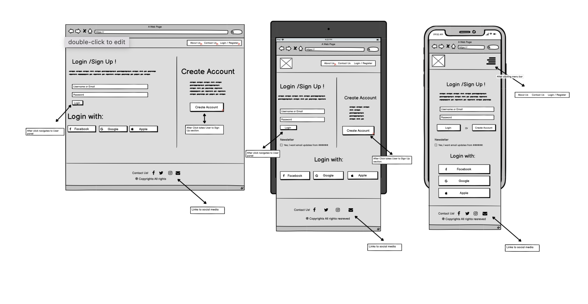
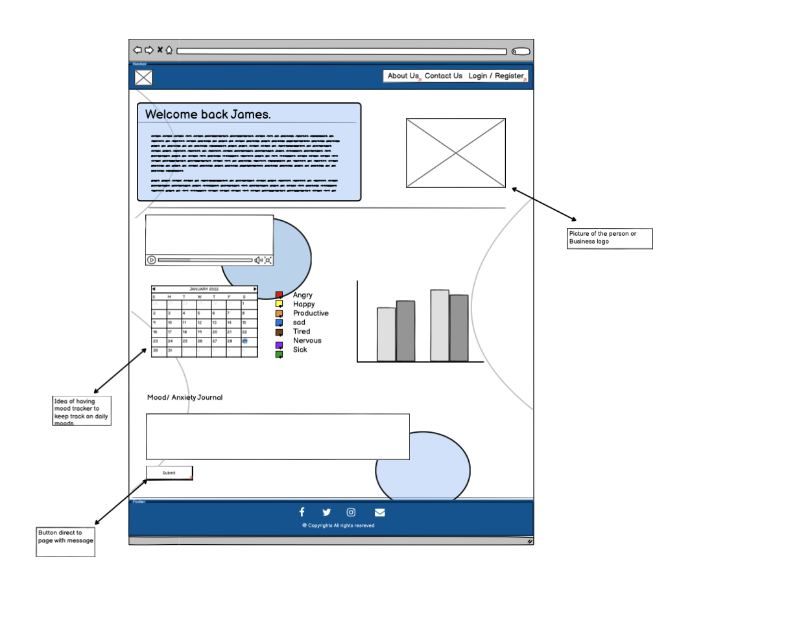

# Centered

 

## Overview

### Project Goals

*  
* 

## UX

### User Stories

* As a user, 


### Wireframes

* Honme Page/Landing Page

 

* Employer Page

 

* About us page

 

* Log in page

 

* Sign Up Page

 

* Contact Us Page


* Employer Profile Page



### Schema
 
### Feaures

* Main Menu

 

## Technologies

### Languages Used

* [Python](https://www.python.org/)

* [HTML](https://developer.mozilla.org/en-US/docs/Web/HTML)

* [CSS](https://developer.mozilla.org/en-US/docs/Web/CSS)

### Libraries and Programs Used

#### Libraries Used

* [Bootstrap](https://getbootstrap.com/docs/4.6/getting-started/introduction/) - A CSS framework to quickly design and customize responsive mobile-first sites.

* [Django](https://www.djangoproject.com/) - A high-level Python web framework that encourages rapid development and clean, pragmatic design.

* [django-allauth](https://www.python.org/) - An integrated set of Django applications addressing authentication, registration, account management as well as 3rd party (social) account authentication.

* [django-crispy-forms](https://django-crispy-forms.readthedocs.io/en/latest/) - An package that gives control to the rendering behavior of your Django forms.

* [cloudinary](https://pypi.org/project/cloudinary/) - Cloudinary is a cloud service that offers a solution to a web application’s entire image management pipeline.

* [dj3-cloudinary-storag](https://pypi.org/project/dj3-cloudinary-storage/) - A Django package that provides Cloudinary storages for both media and static files as well as management commands for removing unnecessary files.

* [dj-database-url](https://pypi.org/project/django-database-url/)- This simple Django utility allows you to utilize the 12factor inspired DATABASE_URL environment variable to configure your Django application.

* [django-heroku](https://pypi.org/project/django-heroku/) - This package automatically configures your Django application to work on Heroku. 

* [gunicorn](https://gunicorn.org/) - Gunicorn ‘Green Unicorn’ is a Python WSGI HTTP Server for UNIX. 

* [oauthlib](https://oauthlib.readthedocs.io/en/latest/) - OAuthLib is a framework which implements the logic of OAuth1 or OAuth2 without assuming a specific HTTP request object or web framework. 

* [Psycopg2](https://pypi.org/project/psycopg2/) - Psycopg2 is the most popular PostgreSQL database adapter for the Python programming language.

* [python3-openid](https://pypi.org/project/python3-openid/) - This is a set of Python packages to support use of the OpenID decentralized identity system in your application,

* [pytz](https://pypi.org/project/pytz/) - This library allows accurate and cross platform timezone calculations

* [requests-oauthlib](https://pypi.org/project/sqlparse/) - This package provides first-class OAuth library support for python requests that would be complex to handle otherwise.

* [sqlparse](https://pypi.org/project/sqlparse/) -  A non-validating SQL parser for Python. It provides support for parsing, splitting and formatting SQL statements.

* [whitenoise](http://whitenoise.evans.io/en/stable/) - A package that simplifies static file serving for Python web apps

* [asgiref](https://asgi.readthedocs.io/en/latest/introduction.html) - It makes it easier to call synchronous APIs from async code and asynchronous APIs from synchronous code so it's easier to transition code from one style to the other.


#### Programs Used

* [Git](https://www.atlassian.com/git) - used for branching, merging, and rewriting repository history.

* [GitHub](https://github.com/) - used a hosting service for Git repositories.

* [GitHub Projects Board](https://github.com/CraigThomasson/trustinsodaHackathon/projects) - used as kanban to-do list for tracking issues and feature progress.

* [Gitpod](https://gitpod.io/) - used as a workspace for Git repositories.

* [Heroku](https://www.heroku.com/) - used to deploy project. 

* [Lucidchart](https://www.lucidchart.com/) - used to create flow charts. 

* [Am I responsive](http://ami.responsivedesign.is/) - used to generate responsive mockup image at the top/beginning of the README.

* [Microsoft Photos](https://www.microsoft.com/en-us/p/microsoft-photos/9wzdncrfjbh4?) - used to resize images.

* [Grammarly](https://www.microsoft.com/en-us/p/microsoft-photos/9wzdncrfjbh4?) - used to ensure documentation is clear and correct.


## Testing

For all testing documentation, please refer to [TESTING](TESTING.md)

## Deployment

### Local Deployment

To make a local copy of this repository, you can type the following into your IDE terminal:

- `git clone https://github.com/CraigThomasson/trustinsodaHackathon.git`

Alternatively, if using Gitpod, you can click below to create your own workspace using this repository.

[](https://gitpod.io/#https://github.com/CraigThomasson/trustinsodaHackathon)

You will need to create an ```env.py``` based on the sample file [envsample.py](https://github.com/CraigThomasson/trustinsodaHackathon/blob/main/envsample.py) as a template

You will then need to add this file ```env.py``` to ```.gitignore``` to prevent it being uploaded to Github and exposed publicly. 

You can store credentials in ```env.py``` which act as environmental variables. Your app can use environmental variables but their values will not be displayed or disclosed in the code. These can be added to Heroku in the deployment steps below. 

### Cloudinary

Step 1 - Creating an account.

- If you already have a Heroku account, please sign in to your existing account.
- If you don't, go to [Cloudinary](https://cloudinary.com/) and create a free account.

Step 2: Access API Environment variable

- Once logged in, navigate to the dashboard. 
- Copy the API Environment variable.

### Heroku Deployment

Prerequisites

- A Github repository 
- Ensuring your [requirements.txt](https://github.com/CraigThomasson/trustinsodaHackathon/blob/main/requirements.txt) is up to date. You can do so using by entering the following line in your terminal:

```
pip3 freeze --local > requirements.txt
```

Step 1 - Creating an account.

- If you already have a Heroku account, please sign in to your existing account.
- If you don't, go to [Heroku.com](https://www.heroku.com) and create a free account.

Step 2: Create an app.

- Click on the 'New' drop down in the upper right-hand corner.
- Select 'Create a new app'.
- When choosing an app name, it will need to be unique to Heroku.
- If the Github repository name or project name is not available, choose a name similar by adding other words, dashes, letters or numbers.
- Enter your chosen 'App name' and select your region.
- Click the 'Create app' button.
- Once app created, on the 'Overview' tab, click "Configure Add-ons".
- Add the Cloudinary and Heroku Postgres add ons.
- Go to the settings tab of Heroku Postgres add on.
- Click view credentials and copy the URL. 


Step 3: Add Config Vars.

- Go to the 'Settings' tab in your app.
- Scroll down to the 'Config Vars' section and click the 'Reveal Config Vars' button.
- We are going to add these config vars.
- KEY = DATABASE_URL and VALUE is URL copied from the Heroku Postgres earlier.
- KEY = SECRECT_KEY and VALUE is the secret key copied from the env.py file in gitpod.
- KEY = CLOUDINARY_URL and VALUE is the copied from the dashboard of your Cloudinary account.


Step 4: Add Buildpacks.

- On the same 'Settings' tab in your app, scroll down to the 'Buildpacks' section. 
- The buildpacks need to be listed in your Settings.
- You'll add the Python buildpack.

Step 5 - Select Github Deployment Method.

- Go to the 'Deploy' tab in your app.
- In the Deployment method' section,  select 'GitHub' and click 'Connect to GitHub'.
- Search for your Github repository name, which will create a list of repository names.
- Click the 'Connect' button, and your Heroku app will link to your Github repository.
- You can choose manual deploys for your app; click 'Deploy Branch' in the 'Manual Deploy' section.
- Once successfully deployed, a green tick will appear next to Deploy to Heroku
- Your app will not update/rebuild each time you push to Github, which will conserve your dyno hours in Heroku. 
- You will need to click 'Deploy Branch' each time you want the app to rebuild after pushing your changes to Github. 
- Or you can choose automatic deploys for your app, 
- Your app will update/rebuild each time you push to Github, which will not conserve your dyno hours in Heroku
- To access your deployed app, scroll to the top and click 'Open app'.

## Credits and Learning Experience

### Content

### Media

### Acknowledgements

